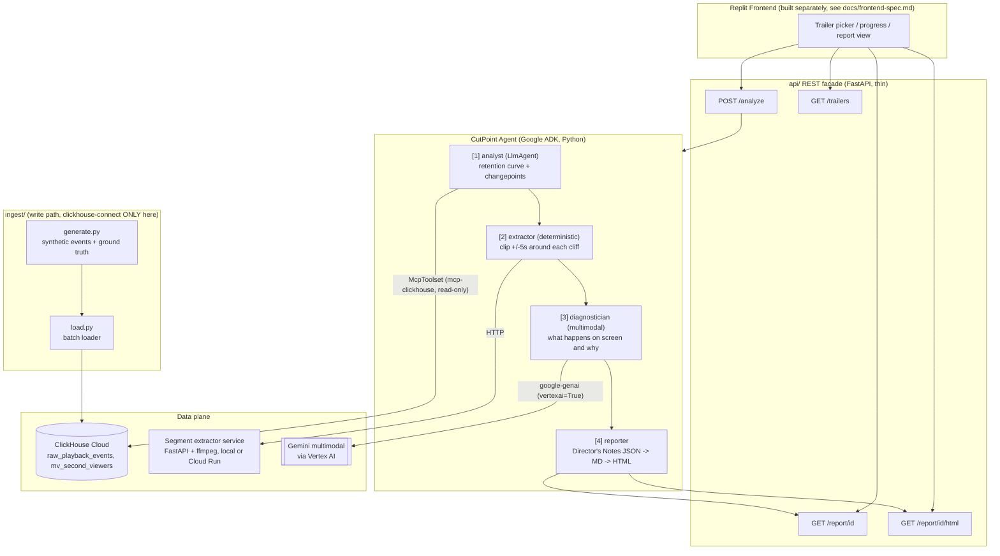

# CutPoint Architecture

## Overview

CutPoint is a deterministic 4-step agent pipeline that fuses per-second trailer audience-
retention analytics (ClickHouse) with Gemini's frame-level video understanding (Vertex AI) to
produce timestamped "Director's Notes" -- exactly where a trailer loses viewers, why, and what
to do about it.

The loop: ClickHouse answers WHERE (second 47, cohort 18-24, 22% retention cliff) -> Gemini
multimodal answers WHY (tone shift / spoiler / pacing collapse in those exact frames) -> the
agent renders Director's Notes with recut recommendations.

## Diagram

## Why these technology choices

- **ClickHouse** for the analytics plane: per-second, per-cohort retention aggregation over
  tens of millions of heartbeat events is exactly ClickHouse's sweet spot (`AggregatingMergeTree`
  + `uniqState`/`uniqMerge`), and its native `windowFunnel()` function gives a real showcase for
  the milestone funnel query without hand-rolled step counting.
- **mcp-clickhouse** as the ONLY agent-side ClickHouse access path: it is read-only by
  construction, which structurally prevents the agent from ever mutating production data --
  the write path (`ingest/`, `make schema`) is a separate, explicitly privileged path using
  `clickhouse-connect` directly.
- **Google ADK's `SequentialAgent`** for the pipeline: the four steps ALWAYS run in the same
  order. The LLM is never asked "what should I do next" -- it is asked "diagnose this clip" and
  "phrase this recommendation." This is a deliberate simplicity constraint (TASK.md rule 6) that
  makes the system auditable and reproducible for a hackathon demo.
- **Vertex AI Gemini** for multimodal perception: the diagnostician step passes each +/-5s clip
  as a `Part` and asks a structured question ("what happens on screen, why would these cohorts
  specifically leave here"). This is real video-frame reasoning, not metadata guessing.
- **FastAPI segment extractor** as its own service: keeps ffmpeg subprocess management outside
  the agent process, and is independently deployable to Cloud Run for a hosted demo.

## Data flow for one `/analyze` call

1. Frontend calls `POST /analyze {trailer_id}`.
2. `api/main.py` invokes `agent/run_pipeline.py`'s `run_live()`, which builds the ADK
   `root_agent` and runs it against an ADK `InMemoryRunner` session seeded with
   `trailer_id`, `video_path`, `title`, `duration_s`.
3. **analyst**: an `LlmAgent` with the `mcp-clickhouse` toolset. Its instruction pins it to
   executing exactly `sql/analysis/retention_curve.sql`, `changepoints.sql`,
   `cohort_divergence.sql`, `milestone_funnel.sql` for the given `trailer_id`, and returns a
   structured `AnalysisResult` (`output_schema`).
4. **extractor**: a deterministic ADK `BaseAgent` (no LLM call). For each cliff in
   `AnalysisResult.cliffs`, it POSTs to the segment extractor service for a `[second-5, second+5]`
   clip and writes an `ExtractionResult`.
5. **diagnostician**: for each clip, calls Gemini via `google-genai` (`vertexai=True`) with the
   clip bytes as a video `Part` plus a prompt naming the exact drop_pct and affected cohorts, and
   parses a structured `Diagnosis` (on_screen, hypothesis, severity, confidence).
6. **reporter**: merges everything into a `DirectorsNotes` pydantic model, writes
   `data/reports/{trailer_id}.json`, and renders Markdown + a self-contained HTML report (inline
   SVG retention curve, no CDN dependency) via `report/render.py`.
7. The API returns `{"report_id": trailer_id}`; the frontend then polls
   `GET /report/{trailer_id}` for the JSON.

## Determinism boundary

The LLM is used for exactly two things: (1) perception -- describing what a specific clip shows
and hypothesizing why it caused churn, and (2) language -- phrasing recommendations. It is never
used to decide which SQL to run, which clips to extract, or what order pipeline steps execute
in -- that is all fixed by `SequentialAgent` and plain Python control flow. See PROGRESS.md for
the specific implementation note on why `extractor`, `diagnostician`, and `reporter` are
implemented as `BaseAgent` subclasses wrapping independently-testable functions rather than as
`LlmAgent`s with freeform tool selection.
