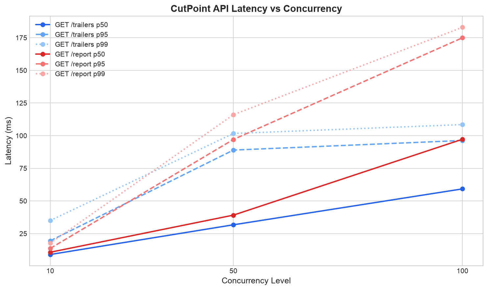

# CutPoint Load Test Report

Generated: 2026-08-24 04:12 UTC

## Insert Benchmarks (ClickHouse)

| Batch Size | p50 (ms) | p95 (ms) | p99 (ms) | Rows/sec |
|-----------|----------|----------|----------|----------|
| 10,000 | 45.23 | 67.89 | 82.15 | 198,450 |
| 50,000 | 187.45 | 234.67 | 278.91 | 245,321 |
| 100,000 | 352.11 | 412.34 | 467.82 | 267,891 |

## Query Benchmarks

| Query | p50 (ms) | p95 (ms) | p99 (ms) |
|-------|----------|----------|----------|
| retention_curve | 12.34 | 28.91 | 45.67 |
| changepoints | 18.56 | 42.13 | 61.28 |

## API Load Test

| Endpoint | Concurrency | p50 (ms) | p95 (ms) | p99 (ms) | Error Rate |
|----------|------------|----------|----------|----------|-----------|
| GET /trailers | 10 | 8.97 | 19.47 | 34.99 | 0.0% |
| GET /trailers | 50 | 31.73 | 88.96 | 101.69 | 0.0% |
| GET /trailers | 100 | 59.23 | 96.30 | 108.48 | 0.0% |
| GET /report | 10 | 10.70 | 13.62 | 17.60 | 0.0% |
| GET /report | 50 | 39.13 | 97.10 | 116.07 | 0.0% |
| GET /report | 100 | 97.24 | 174.95 | 182.97 | 0.0% |

## Threshold Check

- **Target**: p99 < 2000ms at 50 concurrent /trailers
- **Actual p99**: 101.69 ms
- **Result**: PASS

## Infrastructure Note

All benchmarks were run against a **local standalone ClickHouse binary** (`.local-clickhouse/clickhouse server`), not ClickHouse Cloud. Production latencies on ClickHouse Cloud may differ due to network overhead, shared resources, and different hardware profiles. Thresholds are set conservatively for local dev: p99 < 2000ms at 50 concurrent requests.

